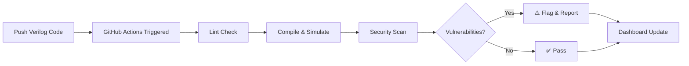

<p align="center">
  
</p>

<h1 align="center">⚡ VeriFlow</h1>
<h3 align="center">Automated CI/CD & Security Pipeline for Digital Design</h3>

<p align="center">
  <a href="#-features"></a>
  <a href="#-quick-start"></a>
  <a href="#-security-scanner"></a>
  <a href="#-github-ecosystem"></a>
</p>

<p align="center">
  <em>Software developers have automated testing. Hardware designers deserve it too.</em>
</p>

---

## 🎯 What is VeriFlow?

**VeriFlow** is an end-to-end CI/CD pipeline for VLSI and digital hardware design that brings modern DevOps practices to the world of chip design. Push your Verilog code, and VeriFlow automatically:

1. **🔍 Lints** your HDL code for syntax and style issues
2. **🧪 Simulates** your designs using Icarus Verilog testbenches
3. **🛡️ Scans** for hardware security vulnerabilities (Hardware Trojans)
4. **📊 Reports** results with a beautiful web dashboard

## ✨ Features

| Feature | Description |
|---------|-------------|
| **Automated Simulation** | Push Verilog → auto-run testbenches via Icarus Verilog |
| **Hardware Trojan Detection** | Static analysis scanner to detect suspicious logic patterns |
| **GitHub Actions CI/CD** | Fully automated pipeline triggered on every push/PR |
| **GitHub Codespaces** | One-click dev environment with all EDA tools pre-installed |
| **GitHub Copilot Integration** | Custom prompts to auto-generate testbench boilerplate |
| **Security Reports** | Detailed vulnerability reports as GitHub Action artifacts |
| **Web Dashboard** | Real-time pipeline results visualization |

## 🚀 Quick Start

### Option 1: GitHub Codespaces (Recommended)

Click the button below to launch a fully configured development environment:

[](https://codespaces.new)

### Option 2: Local Setup

```bash
# Clone the repository
git clone https://github.com/your-username/veriflow.git
cd veriflow

# Install dependencies
sudo apt-get install -y iverilog gtkwave
pip install -r requirements.txt

# Run a simulation
./scripts/run_simulation.sh designs/alu/alu.v designs/alu/tb_alu.v

# Run the security scanner
python -m scanner designs/
```

## 📁 Project Structure

```
veriflow/
├── .github/workflows/       # GitHub Actions CI/CD pipeline
│   └── veriflow.yml
├── .devcontainer/            # Codespaces dev environment
│   ├── devcontainer.json
│   └── Dockerfile
├── designs/                  # Verilog designs & testbenches
│   ├── alu/                  # Arithmetic Logic Unit
│   ├── counter/              # Binary counter
│   └── shift_register/       # Shift register
├── trojan_samples/           # Designs with injected trojans (for demo)
├── scanner/                  # Hardware security scanner (Python)
│   ├── analyzer.py           # Core static analysis engine
│   ├── rules/                # Detection rule definitions
│   └── reporter.py           # Report generation
├── scripts/                  # Automation scripts
├── docs/                     # Dashboard & documentation
│   └── dashboard/            # Web-based results viewer
├── .github/copilot-instructions.md  # Copilot context
└── README.md
```

## 🔒 Security Scanner

VeriFlow's security scanner performs **static analysis** on Verilog/SystemVerilog designs to detect potential hardware trojans and vulnerabilities:

### Detection Rules

| Rule ID | Name | Severity | Description |
|---------|------|----------|-------------|
| `HT-001` | Unused Trigger Logic | 🔴 Critical | Detects rarely-activated combinational logic that could be trojan triggers |
| `HT-002` | Suspicious State Machines | 🟠 High | Identifies hidden state machines with unreachable states |
| `HT-003` | Unauthorized I/O Access | 🔴 Critical | Flags unexpected connections to primary outputs |
| `HT-004` | Time-bomb Patterns | 🟠 High | Detects counter-based activation sequences |
| `HT-005` | Covert Channels | 🟡 Medium | Identifies potential side-channel leakage paths |
| `LINT-001` | Undriven Signals | 🟡 Medium | Signals declared but never assigned |
| `LINT-002` | Multi-driven Nets | 🟠 High | Multiple drivers on the same net |
| `LINT-003` | Latch Inference | 🟡 Medium | Unintended latch creation from incomplete case/if |

### Example Report

```
╔══════════════════════════════════════════════════════════════╗
║                  VeriFlow Security Report                    ║
╠══════════════════════════════════════════════════════════════╣
║ Design: alu_trojan.v                                        ║
║ Date:   2026-03-17 15:45:00                                 ║
║ Status: ⚠️  VULNERABILITIES DETECTED                        ║
╠══════════════════════════════════════════════════════════════╣
║                                                              ║
║ [CRITICAL] HT-001: Unused Trigger Logic                     ║
║   Line 45: Signal 'trigger_cnt' increments on rare input     ║
║   combination but is never used in primary outputs.          ║
║                                                              ║
║ [HIGH] HT-004: Time-bomb Pattern                            ║
║   Line 52: Counter 'trigger_cnt' compared against magic      ║
║   constant 32'hDEAD_BEEF — classic trojan activation.        ║
║                                                              ║
║ Summary: 2 critical, 1 high, 0 medium, 0 low                ║
╚══════════════════════════════════════════════════════════════╝
```

## 🐙 GitHub Ecosystem Integration

### GitHub Actions

VeriFlow's CI/CD pipeline is defined in `.github/workflows/veriflow.yml` and runs automatically on every push and pull request:

```yaml
# Simplified workflow
on: [push, pull_request]
jobs:
  lint → simulate → security-scan → report
```

### GitHub Codespaces

The `.devcontainer/` configuration provides a complete hardware development environment:
- **Icarus Verilog** — Verilog simulation
- **GTKWave** — Waveform viewing
- **Yosys** — Synthesis
- **Python 3.11** — Security scanner runtime

### GitHub Copilot

Custom instructions in `.github/copilot-instructions.md` help Copilot understand hardware design context and generate:
- Testbench boilerplate with clock generation and reset logic
- Assertion-based verification code
- Stimulus generation for common design patterns

## 🏗️ How It Works



## 📊 Dashboard

VeriFlow includes a web-based dashboard (hosted via GitHub Pages) that visualizes:
- Pipeline run history
- Simulation pass/fail results
- Security scan reports
- Waveform previews

## 🏆 Built for GitHub DevDays Hackathon

VeriFlow showcases deep integration with the GitHub ecosystem:

| GitHub Feature | How VeriFlow Uses It |
|----------------|----------------------|
| **GitHub Actions** | Complete CI/CD pipeline for hardware verification |
| **GitHub Codespaces** | Pre-configured EDA development environment |
| **GitHub Copilot** | AI-assisted testbench and verification generation |
| **GitHub Pages** | Dashboard hosting for pipeline results |
| **GitHub Artifacts** | Simulation logs, waveforms, and security reports |

## 📝 License

This project is licensed under the MIT License — see the [LICENSE](LICENSE) file for details.

---

<p align="center">
  Built with ❤️ for <strong>GitHub DevDays Hackathon 2026</strong>
</p>
